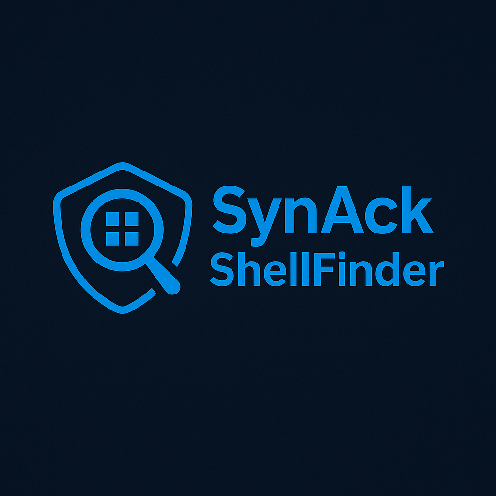

    

  
  
  
  
  

---

# 🔥 SynAck ShellFinder

✓ **SynAck ShellFinder!** is a high-speed, multi-threaded web shell scanner for recon, research, and red teaming.  
It brute-tests known shell paths (`r57`, `wso`, `c99`, etc.) and reports hits in real-time.

---

## 🚀 Features

- ✅ Multi-threaded scanning (17 threads)
- ✅ Rotating User-Agent headers
- ✅ HTTPS fallback to HTTP
- ✅ SSL cert bypass (`verify=False`)
- ✅ Live spinner with progress and ETA
- ✅ Hits auto-logged to `found_shells.txt`
- ✅ Obfuscated + CMS shell paths supported
- ✅ Clean UI output for mobile/Termux

---

## 📂 Files Included

├── find_shells.py # Main scanner script  
├── targets.txt    # Your list of IPs or domains (example)  
├── shells.txt     # Shell path dictionary  
├── logo.png       # Repo logo for GitHub branding  
└── README.md      # GitHUB's little porn maker  

---

## 🧠 Requirements 
- `requests` library

Install it: 
-bash 
pip install requests

---

## ⚙️ Usage

1. **Set up your targets list:**

Create a file called `targets.txt` with one domain or IP per line.  
You can include `http://` or `https://` — or leave it out and let the scanner try both.

Example 4 targets.txt:
25.032.001.16 
http://26.032.181.0 
https://27.1.1.2 
scanmebabyxx.net 
www.scanmexx.com 
http://somesitexx.com 
https://someothersitexx.net 

Input Format ----> Scanner Behavior
____________________________________
example.com	Tries both http:// and https:// 
http://ip	Only tries http://ip 
https://domain	Only tries https://domain

---

2. **Use the `shells.txt` included:**

This dictionary includes 70+ real-world shell paths, including:
/r57.php /wso.php /c99.php /shell.php /uploads/shell.php /vendor/phpunit/phpunit/phpunit /wp-content/uploads/shell.php /cgi-bin/shell.php....These are just some of them.
You can add more or customize it anytime.

---

3. **Run the scanner:** 
(make sure shells.txt is in the same directory as .py obviously)
-bash 
python find_shells.py targets.txt

<small>(💥🤯BOOM! The script is running so watch shells rain down! 😮)</small>

**📦 Output example:** 
[FOUND SHELL] http://example.com/shell.php [Status: 200] 
[FOUND SHELL] http://example.com/elite_shell.php [Status: 200] 
[FOUND SHELL] http://example.com/admin/shell2.php [Status: 200] 

Anything found will be saved to "found_shells.txt"
You can grep, parse, or import this later.😉
---

💥 17 threads auto-start 

💡 Tries both HTTPS and HTTP with fallback 

🔠Rotates User-Agent headers 

🔒 SSL cert errors are bypassed (verify=False) 

⏳ Shows live progress, ETA, and current target 

✅ Logs all shell hits to found_shells.txt 

---

🧬 Upcoming Features: 

These are planned for future versions: 

[ ] Param-based payload testing (?cmd=, ?act=, ?exec=) 

[ ] Proxy rotation (SOCKS5/HTTP) 

[ ] Local web dashboard  

[ ] Auto-login trigger for discovered shells

---

⚠️ Legal Disclaimer

-->This tool is provided for educational purposes and authorized penetration testing only.
Do not use on systems you do not own or have permission to audit. You are fully responsible 
for all usage of this tool. Always operate with ethics, legality, and respect.

---

✊ Credits:

Developed by: SynAck Network - DEVNET 
SynAckNetwork.com and DevNet are registered trademark's of "Fatass's are HOT!" 🥵 and the letter's "F and U"

